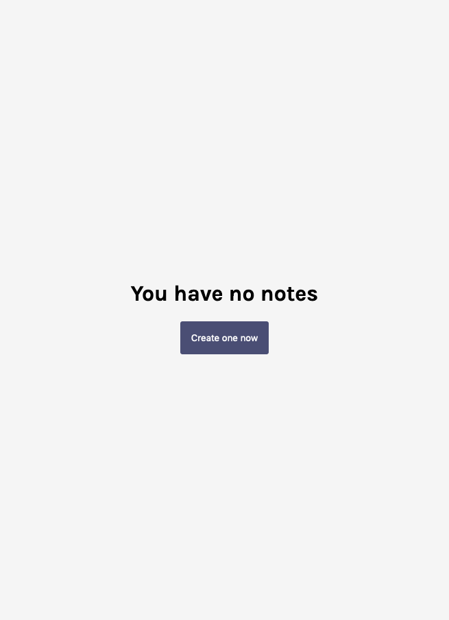
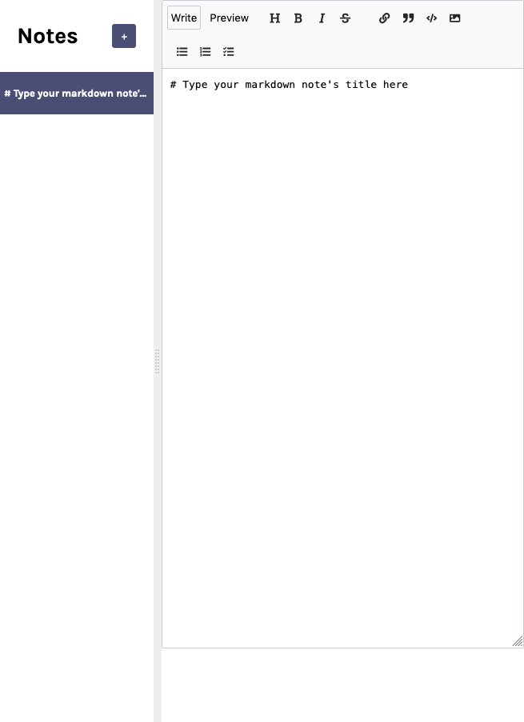
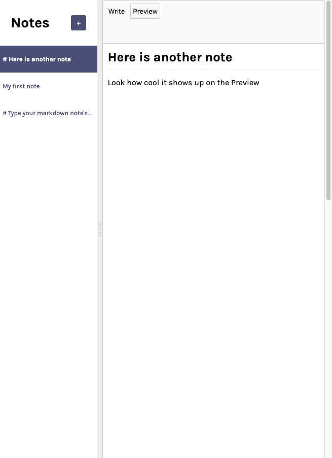
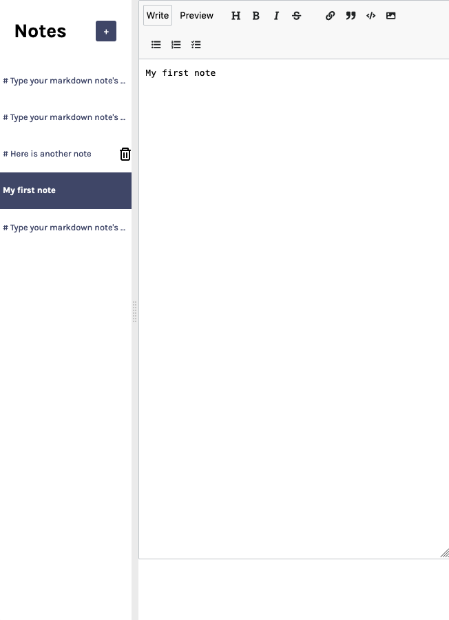

# Scrimba Frontend Career Path - (Notes App - Module 11)

This is a solution to the [Scrimba Frontend Career Path - (Module11-ReactBasics/Notes App)](https://scrimba.com/learn/frontend).

## Table of contents

- [Overview](#overview)
  - [The challenge](#the-challenge)
  - [Screenshot](#screenshot)
  - [Links](#links)
- [My process](#my-process)
  - [Built with](#built-with)
  - [What I learned](#what-i-learned)
  - [Continued development](#continued-development)
  - [Useful resources](#useful-resources)
- [Author](#author)
- [Acknowledgments](#acknowledgments)


## Overview

### The challenge

Create a notes App using React hooks

After this Challenge I should be able to Code/Understand:

- React.useState()
- localStorage.getItem/localStorage.setItem
- JSON.stringify()/JSON.parse()
- Lazy State Initialization
- React.useEffect()
- 3rd party libraries

### Screenshot





- Notice the trash icon (pure CSS icon). By clicking it, the user can delete the note:




### Links

- Solution Github URL: [github.com/Rod-Barbosa/notes-app](https://github.com/Rod-Barbosa/notes-app)
- Live Site URL: [rodrigo-notes-app.netlify.app/](https://rodrigo-notes-app.netlify.app/)

## My process

### Built with

- React Hooks (useState(), useEffect())
- localStorage
- 3rd party libraries (react-split, nanoId, mde, showdown)
- Chrome Dev Tools

### What I learned

JSON.parse()/JSON.stringify() are combined with locaStorage because localStorage needs its key values to be strings, while useState needs the same values to be objects. The integration might seem confusing.... just keep in mind: localStorage.getItem("key")/localStorage.setItem("key", value) -> "key" needs to be a string

```React
    const [notes, setNotes] = React.useState(
        JSON.parse(localStorage.getItem("notes")) || []
    )

{…}

    React.useEffect(() => {
        localStorage.setItem("notes", JSON.stringify(notes))
    }, [notes])
```

Lazy State initialization. Just add a function so that state initialization doesn’t get re-run every time state updates. Performance optimization gains.
```
    const [notes, setNotes] = React.useState(
        () => JSON.parse(localStorage.getItem("notes")) || []
    )
```

Pure CSS icons are amazing, but just copy them, coding from scratch is a nightmare

```CSS

 .gg-trash {
    box-sizing: border-box;
    position: relative;
    display: block;
    transform: scale(var(--ggs,1));
    width: 10px;
    height: 12px;
    border: 2px solid transparent;
    box-shadow:
        0 0 0 2px,
        inset -2px 0 0,
        inset 2px 0 0;
    border-bottom-left-radius: 1px;
    border-bottom-right-radius: 1px;
    margin-top: 4px
}

.gg-trash::after,
.gg-trash::before {
    content: "";
    display: block;
    box-sizing: border-box;
    position: absolute
}

.gg-trash::after {
    background: currentColor;
    border-radius: 3px;
    width: 16px;
    height: 2px;
    top: -4px;
    left: -5px
}

.gg-trash::before {
    width: 10px;
    height: 4px;
    border: 2px solid;
    border-bottom: transparent;
    border-top-left-radius: 2px;
    border-top-right-radius: 2px;
    top: -7px;
    left: -2px
} 
```

### Continued development

More CSS customization might be a way to go in the future. The titles also need work. As of now, the notes titles include the markup. Hiding markup seems like the way to go, but since the user can combine multiple markups at once... the problem can't be solved with a simple regEx.

### Useful resources

- [MDN local storage](https://developer.mozilla.org/en-US/docs/Web/API/Window/localStorage) - So I don’t lose my notes when refreshing the browser


## Author

- Website - [Rodrigo Portfolio](https://www.gelatodigital.com)
- Frontend Mentor - [@Rod-Barbosa](https://www.frontendmentor.io/profile/Rod-Barbosa)
- Github - [@Rod-Barbosa](https://github.com/Rod-Barbosa)

## Acknowledgments

